# DijkstraGL

DijstraGL implements Dijkstra Algorithm using OPENGL.
This project can easily be extended to implement other graph algorithms

# Screenshots

## Main Screen
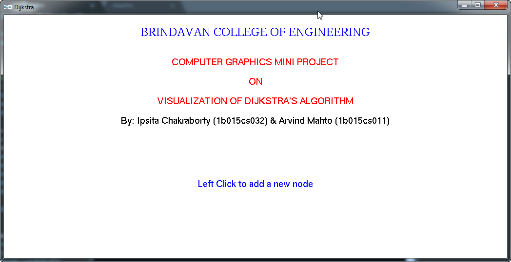

## Add Node by left click
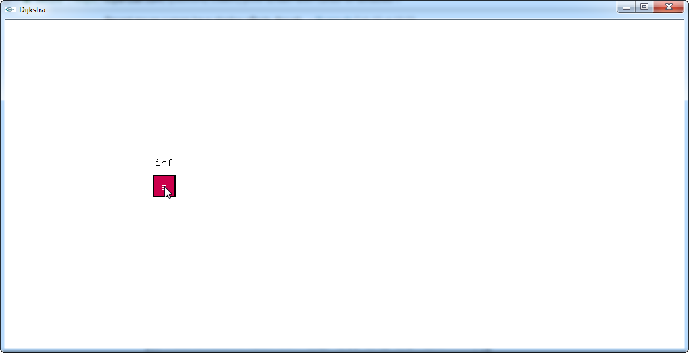

## Multiple Node added
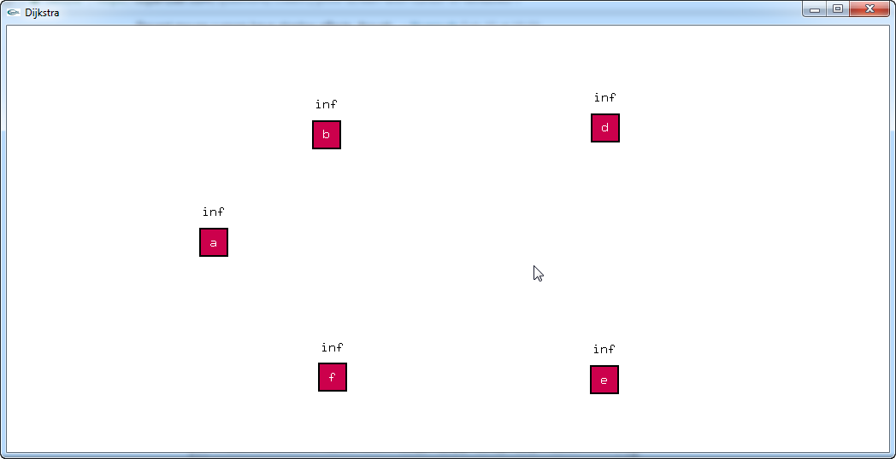

## Add edge by selecting a node and dragging the edge to other node
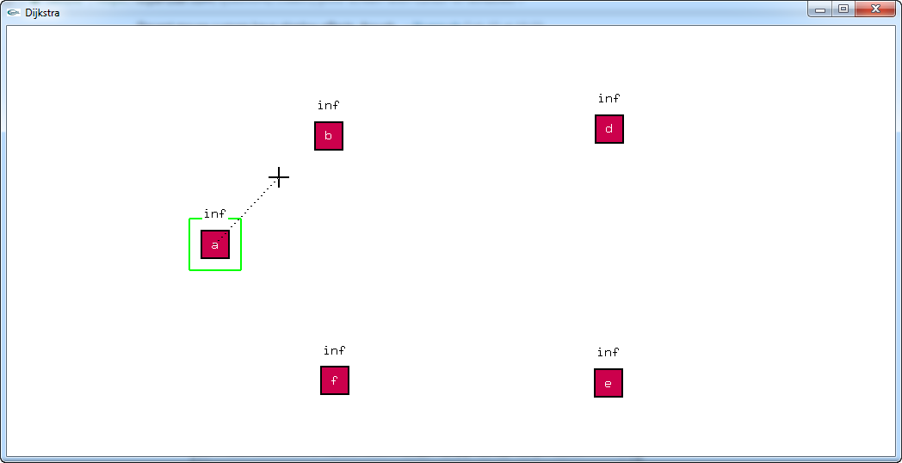

## Multiple edges added
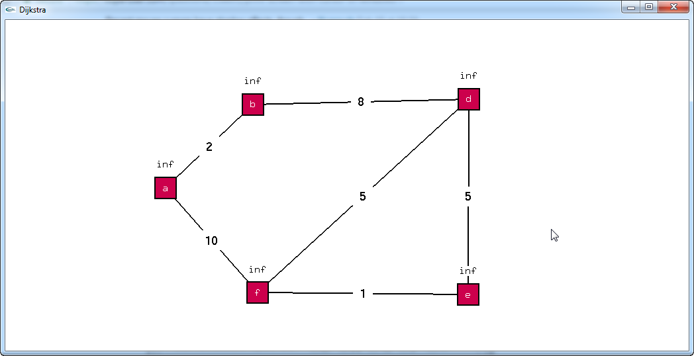

## Right click menu has many options (such as delete,move etc)
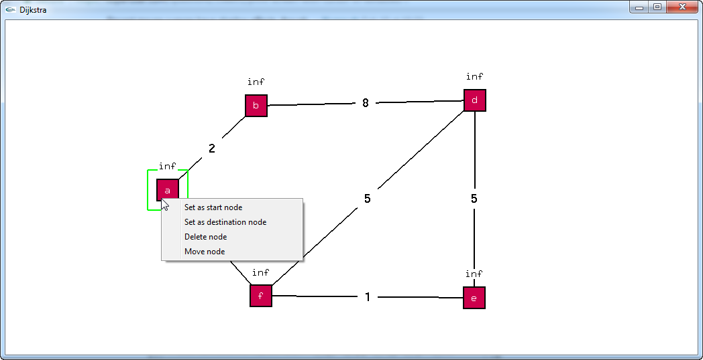

## Delete node
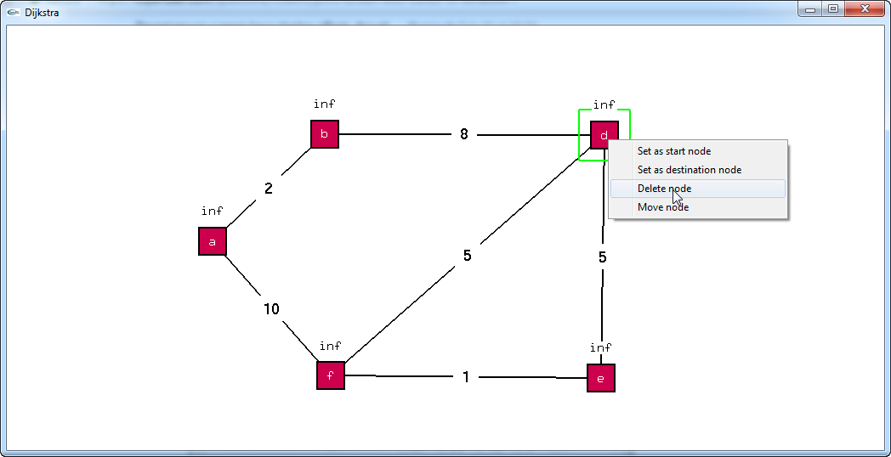
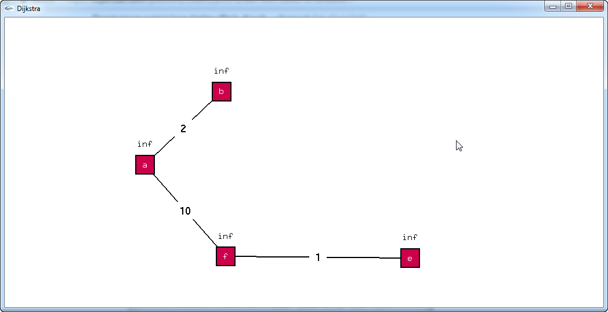

## Move node

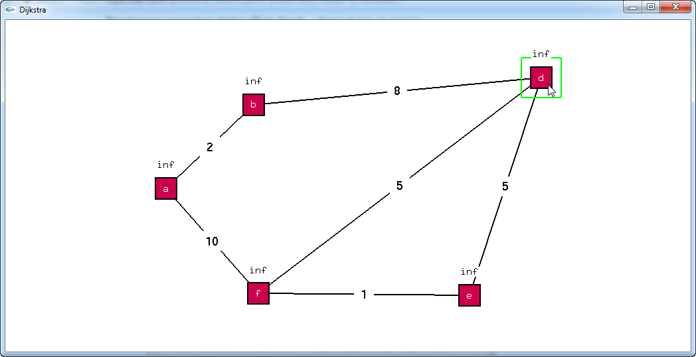

## Select Source to apply dijkstra algo
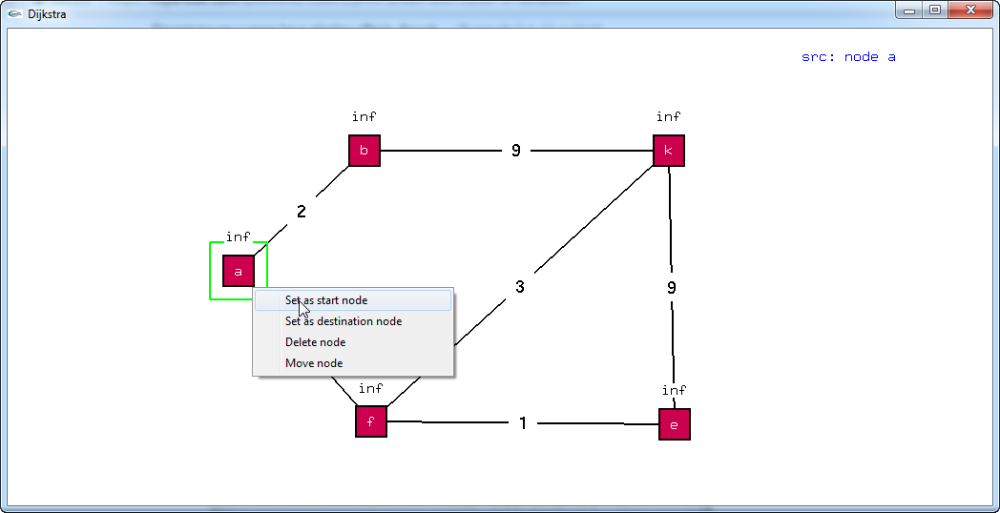

## Select Destination

## Dijkstra algorithm finding the Shortest Path
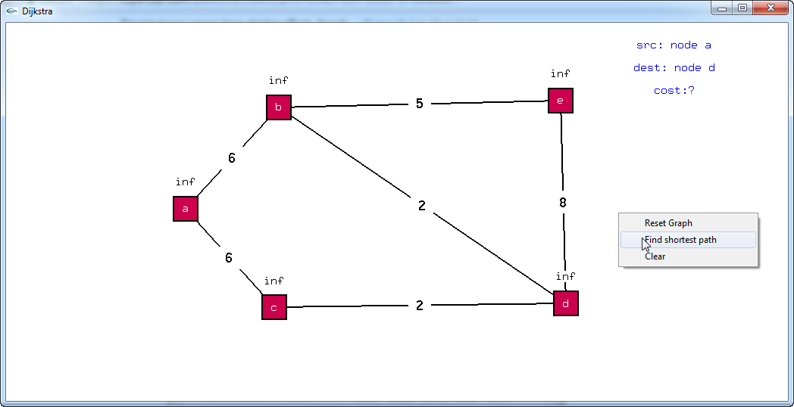
## Searching all paths
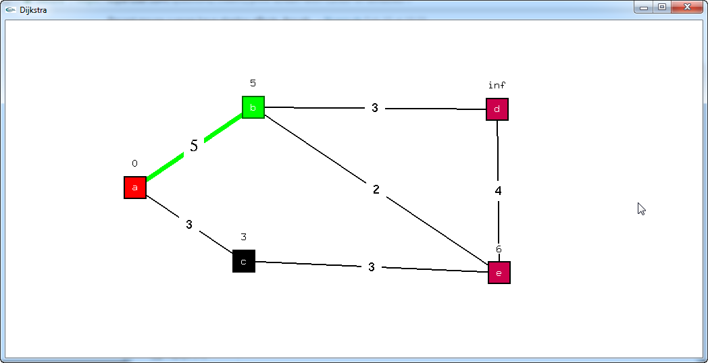
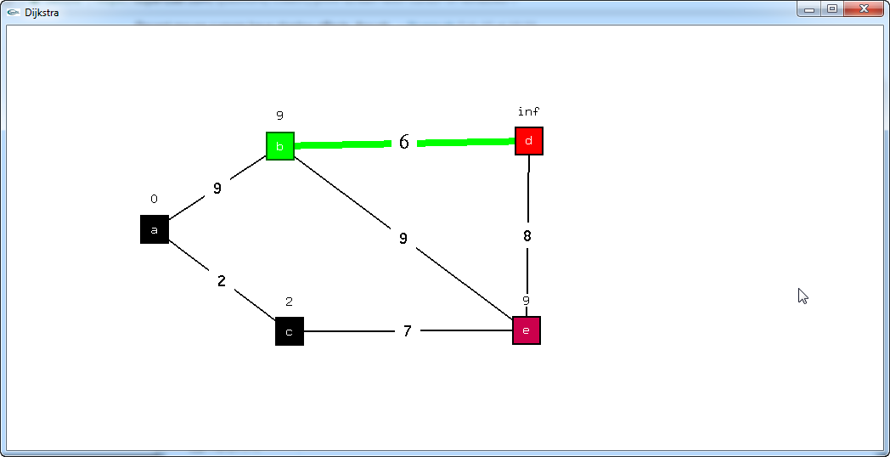
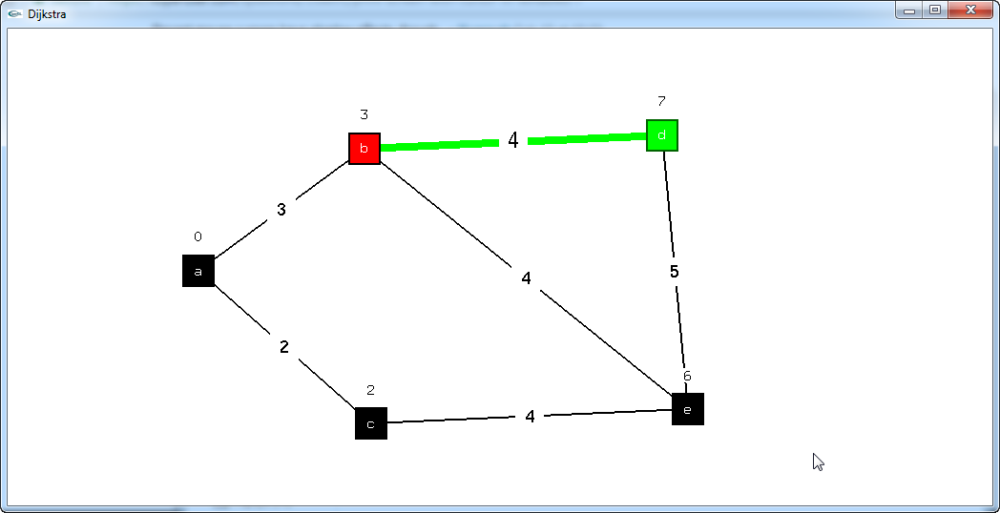

## Shortest path from source to destination highlighted
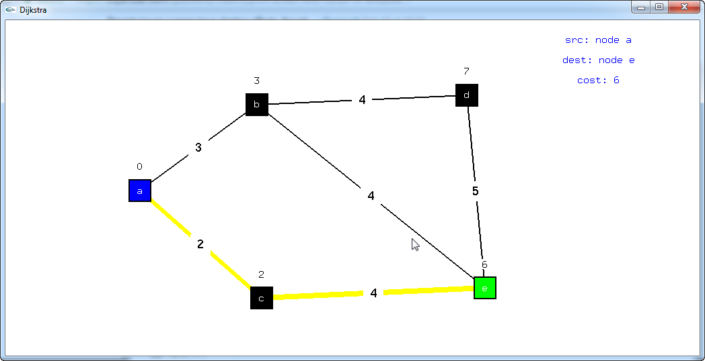

## Clear screen
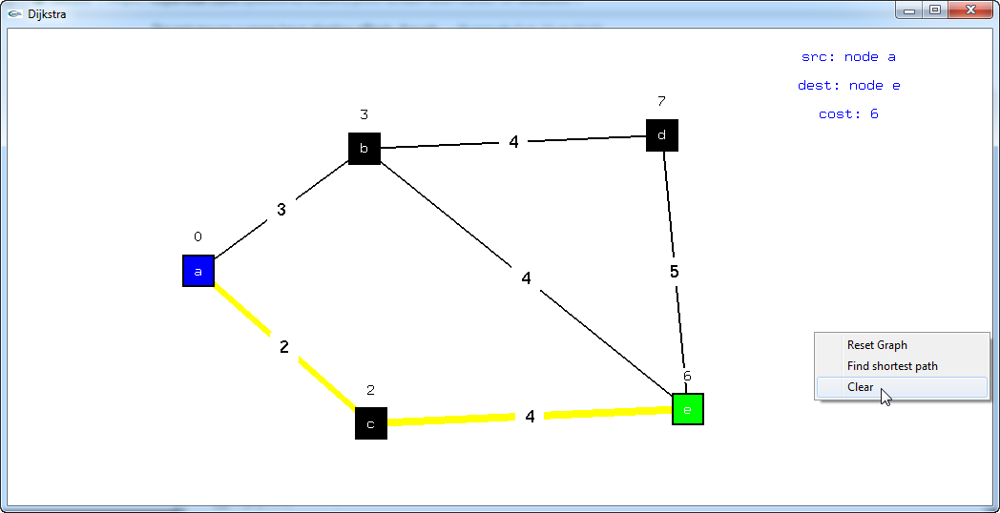

