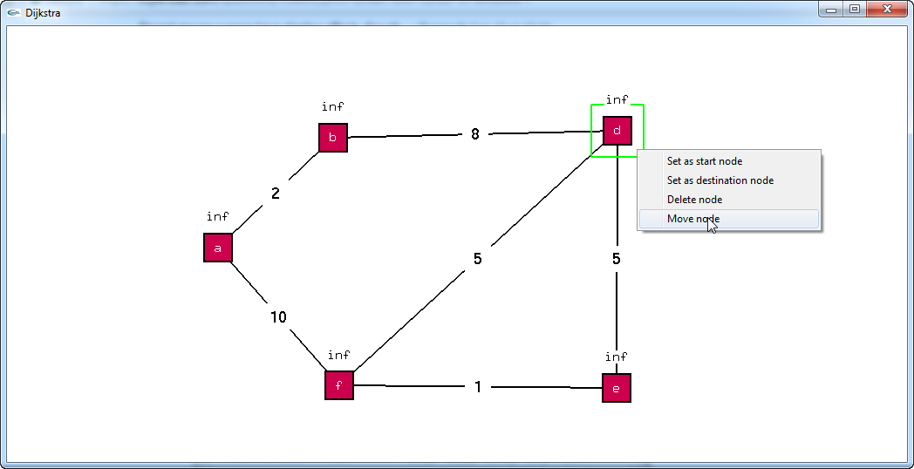

# DijkstraGL

DijstraGL implements Dijkstra Algorithm using OPENGL.
This project can easily be extended to implement other graph algorithms

# Screenshots

## Main Screen

## Add Node by left click

## Multiple Node added

## Add edge by selecting a node and dragging the edge to other node

## Multiple edges added

## Right click menu has many options (such as delete,move etc)

## Delete node

## Move node

## Select Source to apply dijkstra algo

## Select Destination

## Dijkstra algorithm finding the Shortest Path

## Searching all paths

## Shortest path from source to destination highlighted

## Clear screen

